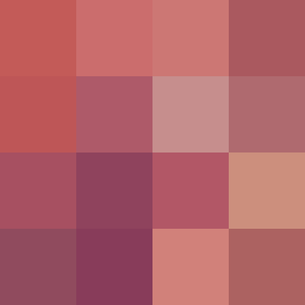

# go-pixelate
**Simple image pixelater**  

## Usage
1. Download `go-pixelate` binary from [releases](https://github.com/unirt/go-pixelate/releases)
   Recommended version: **v0.3**
2. Pixelate image
   ```bash
   ./go-tile -i path/to/image -n 4
   # converted image path will be `./outputs/16blocks_{originalImagePath}.png`
   ```
#### if you want to `go run`
1. Clone this repository
   ```bash
   git clone git@github.com:unirt/go-pixelate.git
   ```
2. Pixelate image
   ```bash
   cd go-pixelate
   go run main.go -i path/to/image -n 4
   # converted image path will be `./outputs/16blocks_{originalImagePath}.png`
   ```
### Args
|arg  |must/optional  |description  |
|:-:|:-:|:-:|
|i  |must  |Path to original image  |
|n  |optional(default `4`)|The square root of the number of blocks in converted image. <br> ex. Converted image will have 16 blocks if you provide `-n 4`|
## Example
```bash
./go-pixelate -i ~/Pictures/sample.png
```
Original(`sample.png`)  
  
Result(`16blocks_sample.png`)  

